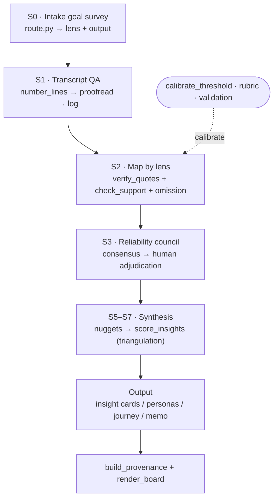

<div align="center">

# 🎙️ Interview Mapper

**Turn interview transcripts into evidence-grounded mappings and cross-interview insights — without the hallucinated quotes, "verbatim-but-unsupported" claims, and run-to-run flip-flopping that plague naive LLM qualitative analysis.**

[](./LICENSE)
[](https://www.anthropic.com)
[](#dependencies)
[](#two-language-versions)
[](#honest-limits)

</div>

---

## Contents

- [Why this exists](#why-this-exists)
- [Pipeline](#pipeline)
- [Two axes, not a pile of templates](#two-axes-not-a-pile-of-templates)
- [Two language versions](#two-language-versions)
- [Quickstart](#quickstart)
- [Repository layout](#repository-layout)
- [Dependencies](#dependencies)
- [Honest limits](#honest-limits)
- [Contributing](#contributing)
- [License](#license)

## Why this exists

"Summarize these interviews" pipelines quietly invent patterns and quotes. The failure modes are well documented: LLM-generated quotes are often **regenerated, not extracted** (~7.7% aren't in the source verbatim), **omissions outnumber fabrications**, a "quote" can be real yet **not support the claim it's attached to** (verbatim ≠ entailment), and subjective labels like eNPS **flip between runs** (LLM-as-judge flip-rate up to 56%).

Interview Mapper turns each of those into an explicit, auditable guardrail.

| Naive pipeline | Interview Mapper |
|---|---|
| Summarizes summaries (compounds hallucination) | Builds **bottom-up from atomic, quoted nuggets** |
| Trusts the model's quotes | **Script-verified verbatim** (`verify_quotes.py`) |
| "Quote is in the text" = done | Separate **entailment** check: quote ⊨ thesis (`check_support.py`) |
| One run, confident label | **N isolated runs → consensus; disputes flagged to a human** (`consensus.py`) |
| "Everyone said X" | **Triangulation**: ≥k distinct interviews before it's a pattern (`score_insights.py`) |
| Ranks by frequency | **Frequency × criticality** + surfaces **role tensions** |
| Opaque conclusions | **Full audit trail** insight→quote→line→interview + HTML board |

Full rationale and citations: [`references/reliability.md`](./interview-mapper-en/references/reliability.md) (RU: [`interview-mapper/references/reliability.md`](./interview-mapper/references/reliability.md)). All references/templates are mirrored 1:1 between the two language folders.

## Pipeline



## Two axes, not a pile of templates

Instead of one template per situation, the skill separates **how you extract** from **what you build** — so `N lenses × M outputs` cover `N×M` tasks:

**6 lenses** (extract from one interview): `org-mapping` · `JTBD` · `CustDev` · `expert` · `visitor-experience` · `positioning/brand`

**5 outputs** (build from N): `insight cards` · `personas` · `journey map` · `opportunities/prioritization` · `decision memo`

An intake survey (S0) asks *goal* + *who you interviewed* and `route.py` picks the lens, the output, and the applicable pipeline steps.

## Two language versions

| Folder | Package | Language |
|---|---|---|
| [`interview-mapper/`](./interview-mapper) | `interview-mapper.skill` | 🇷🇺 Russian |
| [`interview-mapper-en/`](./interview-mapper-en) | `interview-mapper-en.skill` | 🇬🇧 English |

## Quickstart

**Install (Claude Desktop / Cowork):** open the `.skill` file → **Save skill**.
**Install (manual):** copy a `interview-mapper*/` folder into your skills directory.

Then, in a session, just ask naturally:

> "Analyze this employee interview — role, processes, risks, how they feel about the work. Back every conclusion with a quote."

The skill runs S0→S7, and the scripts are also usable standalone — run them from inside the skill folder you installed (`interview-mapper/` or `interview-mapper-en/`):

```bash
cd interview-mapper-en/   # or interview-mapper/ for the RU version

# route the pipeline from the intake answers
python scripts/route.py --goal org --respondent employee --output insights --n 6

# verify that quotes in a mapping are actually verbatim
python scripts/extract_claims.py mapping.md --interview NAME --role ROLE
python scripts/verify_quotes.py --transcript transcript_nl.txt --claims mapping_claims.json

# score cross-interview clusters (triangulation, freq×criticality, tensions)
python scripts/score_insights.py nuggets.json --k 3
```

## Repository layout

```
.
├── interview-mapper/          # RU skill (source)
│   └── ...                    # same layout as interview-mapper-en/ below, mirrored 1:1
├── interview-mapper-en/       # EN skill (source)
│   ├── SKILL.md               # orchestrator: S0–S7
│   ├── templates/             # 6 lenses
│   ├── outputs/               # 5 outputs
│   ├── references/            # pipeline, reliability, synthesis, rubric, validation, intake
│   ├── scripts/               # 13 stdlib-only tools
│   └── evals/                 # eval prompts
├── interview-mapper.skill     # installable RU package
├── interview-mapper-en.skill  # installable EN package
├── README.md · LICENSE · CONTRIBUTING.md
```

## Dependencies

Python **stdlib only**. `rapidfuzz` is used if installed (more accurate verbatim matching), else auto-fallback to `difflib`. `python-docx` only for `.docx` input.

## Honest limits

This is a research preview. Read these before trusting output:

- **Thresholds calibrated on synthetic data only** (fuzzy 88, coverage 0.6 — see `references/reliability.md`; 104 labeled cases RU+EN) — not yet validated on real transcripts; calibrate on your data (`calibrate_threshold.py`, `references/validation.md`). k=3 is a methodological choice (triangulation), not a tuned metric.
- **Latent constructs** (tone, intent, eNPS) are where LLMs are weakest — always human candidates.
- `n < k` interviews = a **pilot**, not a measurement; synthesis yields only a watchlist.
- The machinery is complete and tested on toy data, but **not yet validated at scale** against a human baseline.

## Contributing

Contributions welcome — see [CONTRIBUTING.md](./CONTRIBUTING.md) for the principles to preserve (grounding, verbatim ≠ support, human-in-the-loop) and dev checks.

## License

[MIT](./LICENSE). The `org-mapping` lens ships an example museum-employee codebook — swap in your own.
